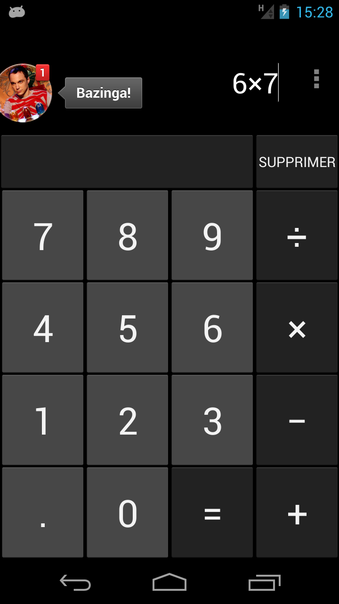
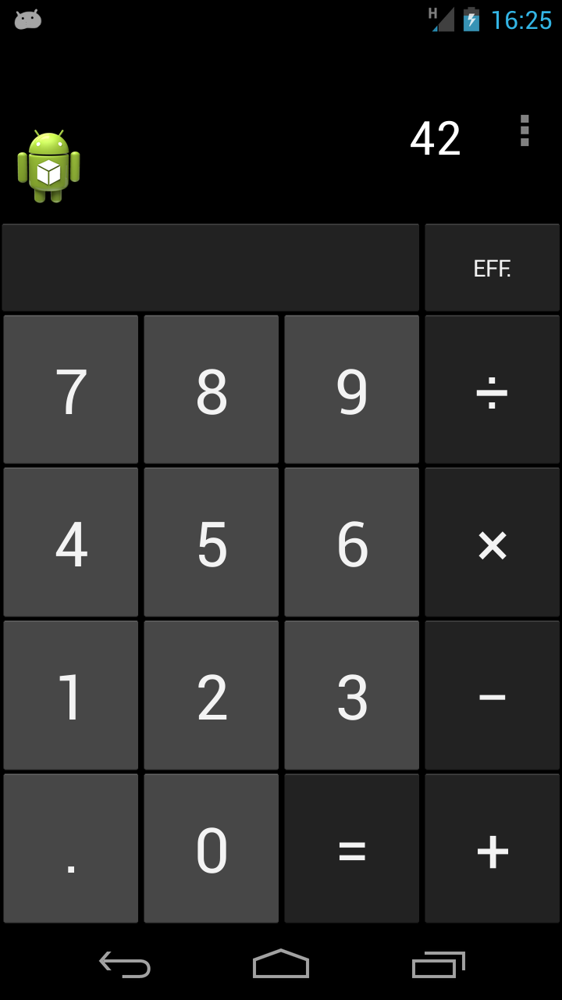

|:material-calendar-edit:|April 14, 2013|

Facebook recently released a new feature in Facebook Messenger: [Chatheads](http://www.engadget.com/2013/04/12/facebook-messenger-updated/).



I was surprised that chatheads could be drawn on top of any app. Here is a quick explanation of how it works.

## No Activity?

At first you may think it's a trick with a transparent activity. Let's see:

```bash
$ adb shell dumpsys activity
Running activities (most recent first):
  TaskRecord{42b03c38 #2 A com.android.launcher U 0}
    Run #0: ActivityRecord{42adf3f8 u0 com.android.launcher/com.android.launcher2.Launcher}
```

No activity! And that's because Messenger uses a service:

```bash
$ adb shell dumpsys activity services
ACTIVITY MANAGER SERVICES (dumpsys activity services)
* ServiceRecord{43242ae0 u0 com.facebook.orca/.chatheads.ChatHeadService}
  intent={act=com.facebook.orca.chatheads.ACTION_HIDE_CHATHEADS cmp=com.facebook.orca/.chatheads.ChatHeadService}
  packageName=com.facebook.orca
  processName=com.facebook.orca
  baseDir=/data/app/com.facebook.orca-1.apk
  dataDir=/data/data/com.facebook.orca
  app=ProcessRecord{42a11228 32622:com.facebook.orca/u0a10126}
  createTime=-9m19s542ms lastActivity=-3m20s499ms
  executingStart=-3m20s499ms restartTime=-9m19s542ms
  startRequested=true stopIfKilled=false callStart=true lastStartId=65
```

## Principle

It's simple: just add a view to a [Window](http://developer.android.com/reference/android/view/Window.html).

As you probably know, an Activity has a Window instance. Dialogs also have their own dedicated Window. Even Services can have Window: [InputMethodService](http://developer.android.com/reference/android/inputmethodservice/InputMethodService.html) uses a Window to receive touch events and draw a keyboard on top of another Window, and [DreamService](http://developer.android.com/reference/android/service/dreams/DreamService.html) is used to create screensavers.

## Permission

To open a new window in which you will draw the chathead, you need the [SYSTEM_ALERT_WINDOW](http://developer.android.com/reference/android/Manifest.permission.html#SYSTEM_ALERT_WINDOW) permission.

> Allows an application to open windows using the type TYPE_SYSTEM_ALERT, shown on top of all other applications. Very few applications should use this permission; these windows are intended for system-level interaction with the user.

```xml
<uses-permission android:name="android.permission.SYSTEM_ALERT_WINDOW"/>
```

This is what your users will see when installing the app:


## Android Head

Now that you have the right permission, you just need to call <a href="http://developer.android.com/reference/android/view/ViewManager.html#addView(android.view.View, android.view.ViewGroup.LayoutParams)">WindowManager#addView()</a> with the view and the corresponding layout params:

```java
public class ChatHeadService extends Service {

  private WindowManager windowManager;
  private ImageView chatHead;

  @Override public IBinder onBind(Intent intent) {
    // Not used
    return null;
  }

  @Override public void onCreate() {
    super.onCreate();

    windowManager = (WindowManager) getSystemService(WINDOW_SERVICE);

    chatHead = new ImageView(this);
    chatHead.setImageResource(R.drawable.android_head);

    WindowManager.LayoutParams params = new WindowManager.LayoutParams(
        WindowManager.LayoutParams.WRAP_CONTENT,
        WindowManager.LayoutParams.WRAP_CONTENT,
        WindowManager.LayoutParams.TYPE_PHONE,
        WindowManager.LayoutParams.FLAG_NOT_FOCUSABLE,
        PixelFormat.TRANSLUCENT);

    params.gravity = Gravity.TOP | Gravity.LEFT;
    params.x = 0;
    params.y = 100;

    windowManager.addView(chatHead, params);
  }

  @Override
  public void onDestroy() {
    super.onDestroy();
    if (chatHead != null) windowManager.removeView(chatHead);
  }
}
```

Don't forget to start the service somehow:

```java
startService(new Intent(context, ChatHeadService.class));
```




## Drag the head

You can now interact with the view. For example, here is a **quick hack** to drag the Android head around:

```java
chatHead.setOnTouchListener(new View.OnTouchListener() {
  private int initialX;
  private int initialY;
  private float initialTouchX;
  private float initialTouchY;

  @Override public boolean onTouch(View v, MotionEvent event) {
    switch (event.getAction()) {
      case MotionEvent.ACTION_DOWN:
        initialX = params.x;
        initialY = params.y;
        initialTouchX = event.getRawX();
        initialTouchY = event.getRawY();
        return true;
      case MotionEvent.ACTION_UP:
        return true;
      case MotionEvent.ACTION_MOVE:
        params.x = initialX + (int) (event.getRawX() - initialTouchX);
        params.y = initialY + (int) (event.getRawY() - initialTouchY);
        windowManager.updateViewLayout(chatHead, params);
        return true;
    }
    return false;
  }
});
```

## Conclusion

Prior to Facebook Chatheads, this trick was already used by some apps. A few examples:

* Display a side [app launcher](https://play.google.com/store/apps/details?id=com.schiztech.swapps)
* Take [screenshots](https://play.google.com/store/apps/details?id=com.liveov.shotux) 
* Draw [notes over apps](https://play.google.com/store/apps/details?id=com.ntkachov.penandpaper)
* Reduce the [screen brightness](https://play.google.com/store/apps/details?id=pt.bbarao.nightmode)

This feature is nice, but remember that *with great power comes great responsibility*.

Please take care of your user pixels.

## Comments

### hidden-markov
Does this imply that Facebook Chatheads (or any application with SYSTEM_ALERT_WINDOW permission) is able to conduct keylogging and take screenshots at arbitrary time?


### kvgr
Great tutorial!
Is there a way to display image only in launcher? When some activity is started, the icon should disapear.
I thing there may be two ways:
1. parameter for WindowManager
2. detecting running app
But I wasnt lucky to find the solution...

### pickledolives
Your tutorial is missing the point, that you need to register your service in the Android manifest file under the application tab.