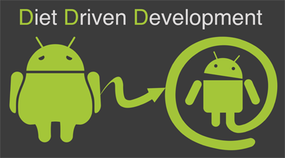

|:material-calendar-edit:|December 22, 2012|

Two years ago, I created [AndroidAnnotations](http://androidannotations.org). 

> Lesson n°1: think before writing your first commit message

Time to take a look back at the last two years!

  <h4>Warning!</h4>
  This article contains trivia, useless statistics, and too much <em>me</em> and <em>I</em>. 
You have been warned.

## @Background

I started writing Android apps in 2009. I came from the Java/JEE world, in which you can find tons of frameworks and good practices. Android didn't feel right: my whole codebase was tied to the `Activity` class, and I didn't find the code to be much readable and maintainable.

I wanted to decouple my code components using [IoC & Dependency Injection](http://en.wikipedia.org/wiki/Dependency_injection), so I tried a few things:

* [Spring IoC](http://en.wikipedia.org/wiki/Spring_Framework), which relied on JDK classes not available in Android, and crashed.
* Creating the dependency graph manually, in code. Worked great, until the dependency graph became too big and hard to maintain.
* Creating a small [DI container](http://code.google.com/p/yasdic/) that didn't rely on reflection. It wasn't typesafe though, and it required tons of anonymous classes.

Then I discovered [RoboGuice](http://roboguice.org), started using it and [contributing](https://github.com/emmby/roboguice/graphs/contributors). I really liked that you could inject Android specific components such as views and resource. This isn't really dependency injection, but it still makes your code much more readable. The bad part though was the performance hit on startup, because RoboGuice relied on reflection.

On the 14th of december 2010, Olivier Croisier presented the Annotation Processors [at the ParisJUG](http://www.parisjug.org/xwiki/bin/view/Meeting/20101214). A few days later, AndroidAnnotations was born.

> The name **AndroidAnnotations** comes from the `AndroidAnnotationProcessor` class that handles the annotation processing.

The focus in AndroidAnnotations has never really been about dependency injection, but rather about creating annotations to simplify your code and make your life easier, at compile time. It started with view injection, then event binding (based on GWT [@UiHandler](http://google-web-toolkit.googlecode.com/svn/javadoc/2.0/com/google/gwt/uibinder/client/UiHandler.html)), resource injection, simplified threading…

## @Timeline

* **December 2010** First commit

* **January 2011** First external [code contribution](http://code.google.com/p/androidannotations/issues/detail?id=1)

* **April 2011** Release of the **2.0** version

* **August 2011** Roy Clarkson mentions AndroidAnnotations on the [SpringSource Blog](http://blog.springsource.com/2011/08/26/clean-code-with-android/)

* **September 2011** *eBusiness Information* becomes the official sponsor

* **October 2011** Matthias Kaeppler mentions AndroidAnnotations at DroidCon London 2011

* **January 2012** Migration from Google Code to GitHub

* **April 2012** Talk at [Devoxx France](http://www.parleys.com/#id=3259)

* **October 2012** Talk at [Devoxx](http://www.parleys.com/#id=3550)

## @RandomStats

* **953** commits and more than **35000** lines of code
* **124** Pull Requests
* **15** code [contributors](https://github.com/excilys/androidannotations/graphs/contributors)
* More than **400** apps on Google Play ([source](http://www.appbrain.com/stats/libraries/details/android-annotations/androidannotations))
* **89** members on the [mailing list](http://groups.google.com/group/androidannotations)
* **36** [StackOverflow](http://stackoverflow.com/questions/tagged/android-annotations) questions
* **319** [@AndAnnotations](https://twitter.com/andannotations) followers
* **355** followers &amp; **419** *+1*  on [Google+](https://plus.google.com/u/0/106206799999983258245/posts)
* **654** stargazers &amp; **101** forks on [GitHub](https://github.com/excilys/androidannotations)

## @Future

AndroidAnnotations will continue to concentrate on simplifying your Android code with compile time code generation. I think Android developers should be able to pickup their frameworks of choice and use them all together.

Here is a [sample project](https://github.com/pyricau/CleanAndroidCode) that uses [Dagger](http://square.github.com/dagger/) for dependency injection, AndroidAnnotations for boilerplate removal, and [Otto](http://square.github.com/otto/) as an event bus.

Let's see what happens over the next two years!

## Comments

