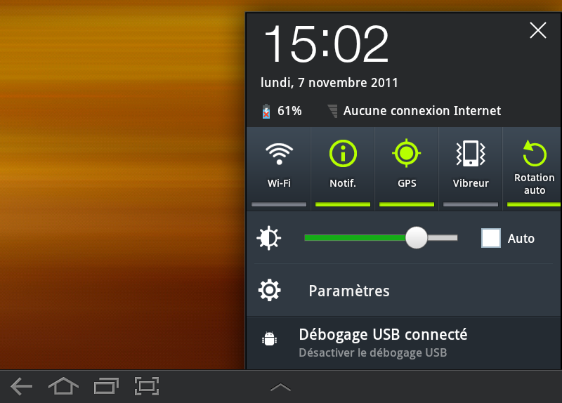
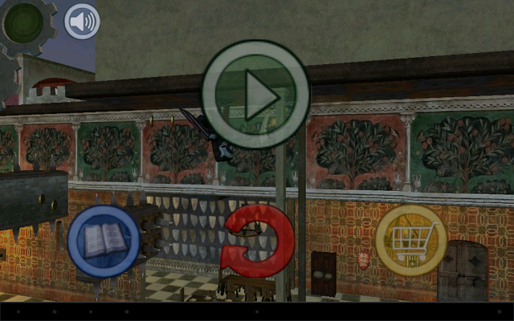
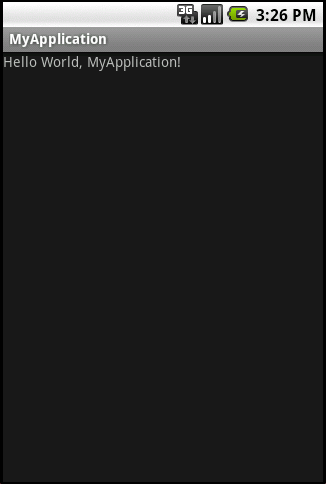
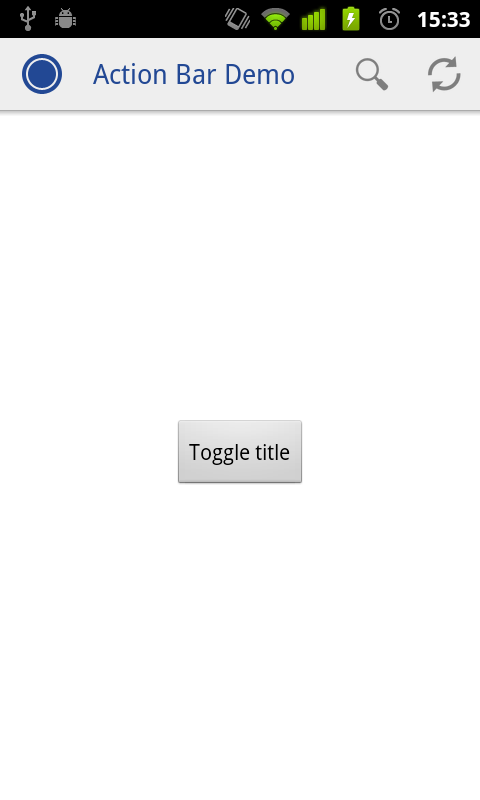
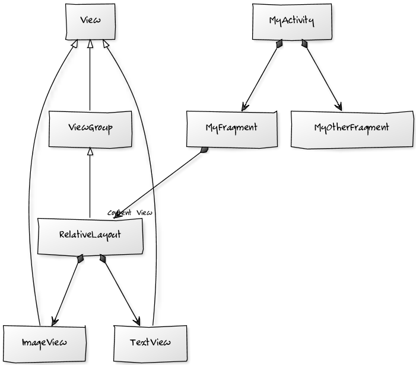
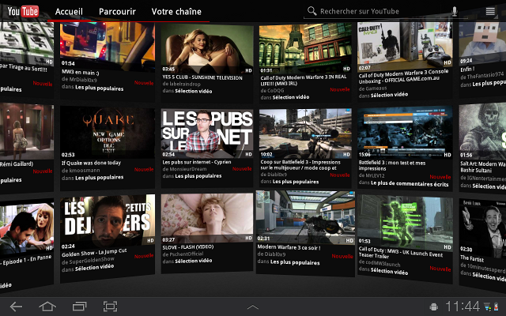

## Introduction

Un [Android Developer Labs](http://android-developers.blogspot.com/2011/08/android-developer-labs-2011.html) (ADL) s'est déroulé à Paris jeudi 27 et vendredi 28 octobre 2011, traitant de l'**optimisation** des applications **Android** pour les **tablettes**.


J'ai eu la chance d'être invité à cet évènement ; j'en ai donc profité pour prendre des notes afin de pouvoir retranscrire le déroulement de cette journée (l'ADL du vendredi).


## Apéro Android

Avant tout, laissez-moi vous parler de l'[apéro Android](http://www.paug.fr/2011/10/apero-android-le-27-octobre-avec-les.html). Sachant que les places pour l'ADL étaient limitées, le Paris Android User Group ([PAUG](http://www.paug.fr/)) a organisé un **apéro Android** le jeudi soir, pour permettre à tous de discuter et de rencontrer les _Android Developer Advocates_.


Les Googlers sont très ouverts et abordables, et nous avons passé une soirée sympatique, en partie aux frais de [FrAndroid](http://www.frandroid.com/). Je vous conseille vivement ce type de rencontre ; c'est un bon moyen d'apprendre et de rencontrer des gens intéressants tout en passant un bon moment.

[](http://code.google.com/p/androidannotations/)

Au cours de la soirée, j'ai eu le plaisir de constater que deux _Android Developer Advocates_ ([Nick Butcher](https://plus.google.com/118292708268361843293/posts) et [Richard Hyndman](https://plus.google.com/115995639636688350464/posts)) connaissaient [AndroidAnnotations](http://code.google.com/p/androidannotations/), suite au [talk](http://uk.droidcon.com/programme/day-2#kaeppler-development) de [Matthias Kaeppler](http://twitter.com/twoofour) à la **DroidCon** 2011.

## L'ADL

Le programme de la journée était le suivant : 


  * Introduction aux tablettes
  * Quoi de neuf dans Ice Cream Sandwich
  * Android Market pour développeurs
  * Développer pour téléphones et tablettes
  * Codelab

J'ai pris des notes du mieux possible ; j'espère que vous me saurez gré des lacunes éventuelles et de la faible mise en forme.

### Introduction aux tablettes

Cette présentation fut consacrée aux spécificités liées à **Honeycomb** et au développement pour **tablettes**.

Notez qu'Honeycomb est uniquement orienté tablette : l'équipe Android n'avait pas le temps de réaliser un OS pour téléphones en parallèle.

#### System bar

Auparavant, les informations système et les notifications étaient situées dans une barre **en haut** de l'écran.


Désormais, cette barre se situe **en bas** de l'écran, et contient en outre les boutons de **navigation**. Cela permet de se débarrasser des boutons **physiques**, qui étaient mal placés lorsque l'on passait en **mode paysage**.


Les **notifications** sont désormais accessibles sans couvrir totalement l'écran, de même qu'un certain nombre de **réglages** et **informations** bien pratiques.



Cette barre peut distraire l'**attention visuelle** lorsque vous souhaitez une **expérience immersive**. Il est possible de la **cacher** en utilisant le code suivant :

```java
mView.setSystemUiVisibility(View.STATUS_BAR_HIDDEN)
```

_Note : je me demande bien pourquoi cette méthode n'est pas statique et appartient à View ; si vous avez une idée, n'hésitez pas à commenter._

Dans le screenshot suivant, comme vous le voyez, la barre ne disparaît **pas totalement**. Elle devient noire, mais les icônes sont remplacés par des points gris **toujours cliquables**.



_Note : ce screenshot montre le dernier niveau de [Wind-up Knight](https://market.android.com/details?id=com.robotinvader.knightmare), un **jeu sympa** qui est un bon exemple de l'efficacité du paiement **in-app** (la preuve, je n'ai pas résisté et ce fût l'occasion de réaliser mon premier paiement in-app)._

#### Action bar

Vous souvenez-vous d'Android 1.X, où la barre de titre occupait une place énorme qui ne servait à rien ?



Autant utiliser cet espace !

C'est le principe de l'**action bar**. Celle-ci comporte tout d'abord une **icône cliquable** qui permet de retourner à tout moment à l'**écran d'accueil**.Elle affiche ensuite des éléments liés à la **navigation**, et pour finir des **icônes d'action**.


Cette **action bar** n'est pas nécessairement un composant Android, il s'agit plutôt d'un **design pattern** de **UI**, que toute application Android digne de ce nom devrait respecter.


Le projet **ActionBarCompat**, disponible dans les samples depuis **ADT 14**, met à disposition tout le code et les ressources nécessaires à la création d'une action bar fonctionnant sur toutes les versions d'Android.




_ActionBarCompat sur mon Nexus One (Gingerbread)_

Les **menu items** dans l'**Options Menu** peuvent être rendus disponibles dans les boutons d'action. Il suffit juste d'ajouter l'attribut suivant aux items dans votre **menu.xml** :


```xml
    android:showAsAction="ifRoom|withText";
```

#### Les fragments

Sans trop rentrer dans les détails : les fragments sont des composants de UI, réutilisables. L'utilisation de Fragment permet de repenser la UI, il ne suffit plus de se contenter d'avoir un design fluide qui s'élargit par rapport à la taille de l'écran, il faut organiser les fragments différents suivant l'écran et la place disponible.


Pour être tout à fait honnête, je ne suis qu'à moitié convaincu par ce nouveau système de fragment. Le principe reste proche de celui des activités : il s'agit d'un **controller**, chargé d'**orchestrer** le **code métier** lié à un assemblage de composants graphiques (des **View**).





En soit, ce n'est pas une mauvaise idée. Par contre, on se retrouve encore avec un **modèle par héritage**, comme pour les **activités**. Tout fragment doit hériter de **Fragment**. Il existe un **ListFragment**, un **XXXFragment**, etc, qui tous héritent de **Fragment**.


Le problème, c'est que dès lors que l'on souhaite factoriser du code commun à plusieurs Fragments, il va falloir recréer une sous classe pour chacun des types de Fragment. **AbstractCustomFragment**, **AbstractCustomListFragment**, etc. Et évidemment, si deux frameworks s'amusent à créer leurs propres fragments à étendre, il devient compliqué de les combiner.


Pour faire un parallèle, j'ai l'impression que l'équipe Android persiste à proposer des **servlets**, quand il serait bien plus utile de proposer des **controllers** Spring.

A bien y réfléchir, une **Activity** et un **Fragment** ont ceci de commun qu'ils répondent à des **évènements** (principe des **callbacks** type **onCreate()**), qu'ils renvoient des éléments de configuration (e.g. getLastNonConfigurationInstance()), et qu'ils fournissent des helpers (**getLoaderManager()**, **getPreferences()**, etc).

Pour moi, ces différentes responsabilités devraient appartenir à différents composants.

#### Les Loaders

Les [Loaders](http://developer.android.com/guide/topics/fundamentals/loaders.html) sont un nouveau moyen pour récupérer des données en tâche de fond, en gérant convenablement les problématiques liées au cycle de vie des composants Android.


[](http://commons.wikimedia.org/wiki/File:Samsung_loader.JPEG)

_Samsung loader, by A1C Beatrice Cassetty, U.S. Air Force (public domain)_

C'est une alternative très intéressante à l'[AsyncTask](http://developer.android.com/reference/android/os/AsyncTask.html), qui malgré plusieurs bonnes idées souffre de quelques problèmes :

	
  * Pas de gestion du cycle de vie (activité mise en pause, détruite définitivement, détruite mais pour raison de changement de configuration, etc)
	
  * Pas facile à utiliser : le paramètre générique PARAM n'est pas vraiment utile (en plus, c'est une **vararg**, quelle horreur !), il n'y a pas de gestion des exceptions.


A noter qu'un des premiers risques avec les **AsyncTask**, c'est d'en faire des classes anonymes et de leaker des références vers leur **outer class**, qui est bien souvent une **activité**.


Et pour simplifier votre code de gestion des Threads sur Android, pourquoi ne pas essayer [@Background et @UiThread](http://code.google.com/p/androidannotations/wiki/WorkingWithThreads) sur [AndroidAnnotations](http://code.google.com/p/androidannotations) ?


#### hardwareAccelerated


Pensez à activer le flag suivant dans votre manifest :


```xml
android:hardwareAccelerated="true"
```


Cela permet de bénéficier de l'accélération matérielle pour le rendering, gratos. Il est désactivé par défaut car certaines implémentations dessinant via des canvas peuvent ralentir ou faire crasher votre appli.


Ce n'est normalement pas le cas des composants standards. Comment décider s'il faut l'utiliser ? C'est simple :


  * Activez **hardwareAccelerated**


  * Testez votre application sur Honeycomb. Si elle ne plante pas, c'est bon, vous pouvez dormir tranquille!


#### Renderscript


[Renderscript](http://developer.android.com/guide/topics/renderscript/index.html) est une _nouvelle_ API C permettant de faire du **3D rendering** haute performance. Nouvelle... pas tant que ça! Si j'ai bonne mémoire, [Romain Guy](https://plus.google.com/111962077049890418486/) nous présentait déjà Renderscript au précédent Android Dev Lab, il y a de cela deux ans. Bon, il est vrai que l'API n'a probablement plus rien à voir (initialement, ça n'était même pas du C), seul le concept reste identique.


Les applications **Google Books** et **YouTube** utilisent renderscript : Google Books pour **tourner les pages**, et YouTube pour l'écran avec toutes les vidéos visibles en même temps.





#### Développement pour tablettes, quelques règles simples

	
  * Mesurer en [dp](http://developer.android.com/guide/practices/screens_support.html#density-independence) plutôt qu'en pixels
  * Utiliser des layouts extensibles	
  * Centraliser les dimensions dans **dimens.xml**, de façon à pouvoir les overrider grâce au mécanisme de ressources
  * Supporter le mode paysage et ne pas bloquer en mode portrait. N'oubliez pas que la manière d'utiliser une tablette est essentiellement en paysage. Beaucoup d'application ont un écran de chargement de l'application en portrait, ce n'est pas très malin !

#### Mettre à jour votre application pour Honeycomb
	
  * Ajoutez des graphiques pour les hautes résolutions (**xhdpi**)

	
  * Utilisez des fragments, même pour les anciennes versions d'Android (grâce à la [compatibility library](http://developer.android.com/sdk/compatibility-library.html))
	
  * N'oubliez pas d'ajouter `<uses-sdk android:targetSdkVersion="14" />` dans votre manifest, notamment pour bénéficier automatique de la nouvelle Action bar sur Honeycomb

Voilà qui conclu la première moitié de ce compte rendu sur l'Android Dev Lab, je vous conterai la fin de cette journée lors du prochain article.

> Edit: en fait, il n'y a jamais eu de prochain article :)

## Comments

## [Frank Harper (@franklinharper)](http://twitter.com/franklinharper)

Tout à fait d’accord quand tu soulignes la pénibilité de sous classer chacun des types de Fragment/Activity! J’espérais qu’une solution plus élégante allait apparaître avec Android 4.0.

Pour activer l’Action bar un targetSdkVersion=”11″ devrait suffire; mais si on peut tester avec ICS pourquoi pas aller directement en targetSdkVersion=”14″!