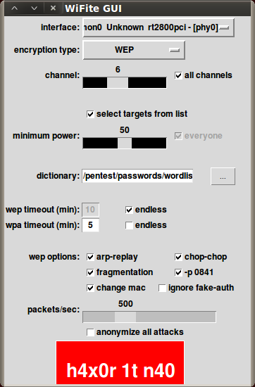
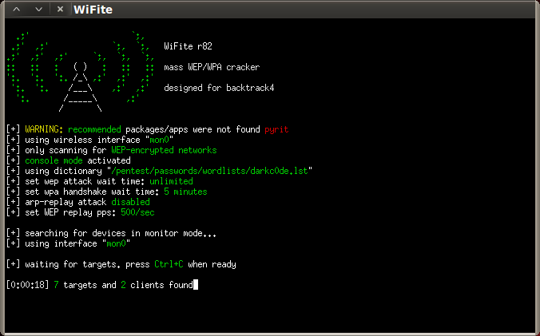
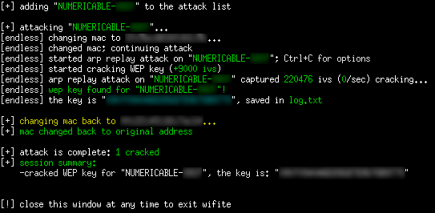

Imaginons que vous ayez besoin de **craquer** le mot de passe de votre propre réseau Wifi, protégé par une **clé WEP**. Je parle bien de _votre propre réseau Wifi_, car je suis sûr qu'il ne vous viendrait jamais à l'idée de craquer l'accès de votre voisin, sachant que c'est totalement **illégal**. 

Craquer une clé WEP peut être l'affaire de quelques minutes, et pourtant, aujourd'hui encore, de très nombreux réseaux Wifi de particuliers sont protégés par WEP. Même le [New York Times](http://www.nytimes.com/2011/02/17/technology/personaltech/17basics.html) en parle. Faites passer le mot, il faut que cela change.

Les techniques pour y parvenir se sont considérablement améliorées ces dernières années. Parallèlement à ces techniques, c'est aussi leur facilité de mise en œuvre qui a formidablement évolué.

Aujourd'hui, quelques clics suffisent : même **mamie peut craquer du Wifi**, et c'est l'objet de cet article.

## Mise en place


### Matos

En termes de matériel, une carte Wifi suffit. La plupart des cartes conviennent et disposent aujourd'hui de drivers adaptés.

Vous obtiendrez de très bons résultats avec l'[Alfa AWUS036H](http://www.amazon.com/s/ref=nb_sb_noss?url=search-alias%3Daps&field-keywords=AWUS036H&x=0&y=0), a priori la carte la plus puissante du marché (1000mW). Attention par contre, il me semble qu'elle est interdite à la vente en France, effet micro onde garanti ;-).


### OS


Les drivers patchés pour le crack Wifi sont essentiellement disponibles sous Linux. Plus précisément, la distribution [Backtrack](http://www.backtrack-linux.org/downloads/) contient tout le nécessaire. Elle est disponible en **Live CD** et en **Live USB**.

Version mamie : vous trouvez une clé USB avec quelques gigas de libres ; vous suivez [ce tutoriel](http://www.backtrack-linux.org/tutorials/usb-live-install/) ; vous branchez la clé USB ; et vous redémarrez pour booter sur la clé USB (cf. [ce tutoriel](http://www.siteduzero.com/tutoriel-3-12696-tester-et-installer-ubuntu.html#ss_part_2) > **Modifier l'ordre de boot**).

Backtrack démarre, se logue tout seul, et présente une ligne de commande une fois démarré.

Il suffit de taper **startx** pour lancer l'environnement graphique. 

```bash
root@root:~# startx
```
_Notez que le layout de clavier étant par défaut un qwerty, il vous faudra probablement taper **stqrtx**._

Une fois l'environnement graphique démarré, vous pouvez changer le layout de clavier dans _System > Preferences > Keyboard > Layouts_.


## Wifite : à un clic du crack


Le plus dur est fait ! Il ne vous reste plus qu'à récupérer [Wifite](http://code.google.com/p/wifite/) et le lancer.

Téléchargez le script python à cette adresse : [http://wifite.googlecode.com/svn/trunk/wifite.py](http://wifite.googlecode.com/svn/trunk/wifite.py).

Rendez-le exécutable : **chmod +x** ; ou bien clic-droit sur le fichier, sélectionnez _Properties > Permissions_ et cochez
z _Execute: Allow executing file as program_.

Exécutez le script (double clic sur le fichier > _Run_).

Et hop, une bonne grosse interface à la **clicouille** :



Sélectionnez l'interface réseau à utiliser (en général, il n'y en a qu'une). Étant donné que l'on s'intéresse ici au WEP, vous pouvez sélectionner uniquement _WEP_ dans _encryption type_.

De [nombreux paramètres](http://code.google.com/p/wifite/) sont disponibles, mais **pour mamie**, il suffit de cliquer sur **h4x0r 1t n40**, et d'aller **prendre une tisane**.



Wifite se charge de tout, et note les mots de passe crackés dans le fichier **log.txt** créé à côté du script **wifite.py**.



**Bingo !**

## Comments

## Rémi
J’attendais avec impatience que quelqu’un fasse ce travail! Très intéressant en tout cas. Je me permets de m’abonner à ton flux RSS du coup.

## [Piwaï](/contact.html)
Je t'y autorise avec plaisir

## [Bastien](http://blog.excilys.com/)
C’est un peu dommage, du coup ça devient une boite noire à la IIS. On clique sur un bouton et ça fait tout, mais on sait pas vraiment ce que ça fait. Les plus intéressés devraient plutôt se tourner vers aerodump et cie, avec masse de tutos qui explique ce que ça fait, les différentes attaques etc.

## [Piwaï](/contact.html)
Certes, mais Mamie n'en a rien à carrer de comprendre ce que ça fait ;-). Elle veut juste craquer son Wifi, elle est comme ça Mamie.