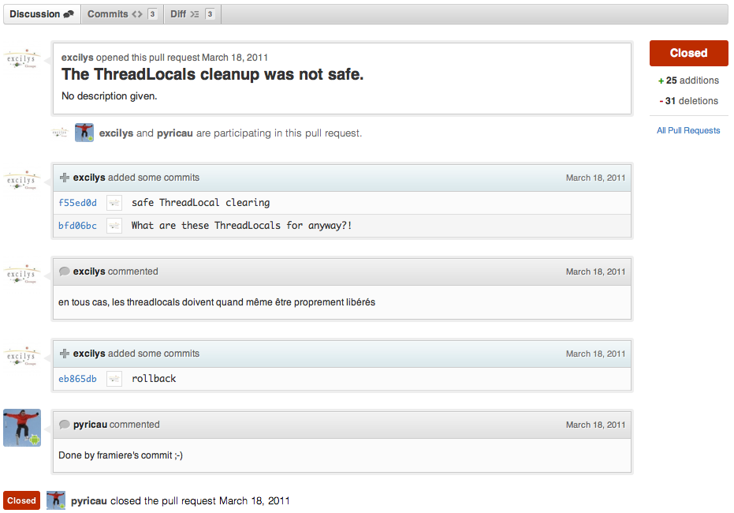

|:material-calendar-edit:|October 9, 2011|

## Introduction


La **startup** pour laquelle je bosse [depuis peu](whenpiwai-quitexcilys-thenreturnnew-blog.md) héberge son **code source** sur [GitHub](http://github.com), et ça, c'est carrément cool.

En plus, nous sommes récemment passé d'un **workflow** old school (tout le monde commit comme des sauvages sur la même branche) à un workflow de type [feature branching](http://nvie.com/posts/a-successful-git-branching-model). Encore plus cool !

Le merge d'une **feature branch** sur la branche d'**intégration** ne se fait qu'après **validation** (revue de code et tests fonctionnels) par quelqu'un qui n'a pas développé la feature. Dans cette optique, les [pull requests](http://help.github.com/send-pull-requests/) de GitHub se révèlent particulièrement pratiques.



Mais trêve de bavardage, venons-en à l'objet de cet article.


## Roooh, j'ai encore oublié ma branche Git !


Avec le **feature branching**, on se retrouve à changer fréquemment de branche.

Du coup, j'ai tendance à ne plus savoir sur **quelle branche je me trouve**, ou encore à oublier le nom précis de la branche, et à taper `git branch` toutes les trois commandes.

Un membre de l'équipe nous a envoyé un **script** plutôt pratique, qui ajoute le **nom de la branche** en cours au prompt de votre terminal :


Le petit truc cool en plus, c'est que le nom s'affiche en **rouge** si vous avez des **modifications locales** (dirty working tree), et en **vert** dans le cas contraire.

Instructions à ajouter à votre fichier **~/.bashrc** (ou **~/.profile** sur Mac) :

```bash
# git branch name in prompt
c_red=`tput setaf 1`
c_green=`tput setaf 2`
c_sgr0=`tput sgr0`

parse_git_branch () {
  if git rev-parse --git-dir >/dev/null 2>&1
  then
          gitver=$(git branch 2>/dev/null| sed -n '/^\*/s/^\* //p')
  else
          return 0
  fi
  echo -e "($gitver) "
}

branch_color () {
        if git rev-parse --git-dir >/dev/null 2>&1
        then
                color=""
                if git diff --quiet 2>/dev/null >&2
                then
                        color="${c_green}"
                else
                        color=${c_red}
                fi
        else
                return 0
        fi
        echo -ne $color
}

PS1="\[\$(branch_color)\]\$(parse_git_branch)\[$(tput sgr0)\]$PS1"
```

Dans le même ordre d'idée, voici un [article bien pratique](http://www.codethatmatters.com/2010/01/git-autocomplete-in-mac-os-x/) pour disposer de l'autocomplétion des noms de branches.

À vous, partagez vos astuces ;-) !

## Comments

### [Olivier Bazoud](http://www.twitter.com/obazoud)
Je préfère utiliser celui ci livré par Git, utiliser la variable __git_ps1 et en plus ça gère beaucoup plus de cas (modifications locales, fichier non trackes, stash, uptream, commit locaux, commits remote, …)

Dans mon ~/.bashrc:

```bash
if [ -f /etc/bash_completion.d/git ]; then
    . /etc/bash_completion.d/git
fi
GIT_PS1_SHOWDIRTYSTATE=true
GIT_PS1_SHOWSTASHSTATE=true
GIT_PS1_SHOWUNTRACKEDFILES=true
GIT_PS1_SHOWUPSTREAM="verbose"

PS1='\A [${debian_chroot:+($debian_chroot)}\[33[01;32m\]\u@\[33[0;33m\]\h\[33[00m\]]\[33[01;31m\]$(__git_ps1)\[33[00m\]% '
```

@obazoud

### [Piwaï](/contact.html)

Merci Olivier, j’avais découvert **bash_completion.d** dans l’[article](http://www.codethatmatters.com/2010/01/git-autocomplete-in-mac-os-x/) cité plus haut, mais je n’avais pas testé la partie modification du PS1.

Je m’en vais essayer ça de ce pas !

PS : je me suis permis d’ajouter la coloration syntaxique à ton commentaire ;).

### [Sam Bessalah (@samklr)](http://twitter.com/samklr)

Ou bien tu peux utiliser [oh-my-zsh](https://github.com/robbyrussell/oh-my-zsh), qui prend en compte git nativement et t’averti dans quelle branche tu te trouves, etc ..
En tout cas impossible d’utiliser le shell sans, pour moi.

### [Piwaï](/contact.html)

@Olivier : après avoir testé, c’est effectivement pas mal mais il manque la couleur :).

@Sam : depuis le temps qu’un de mes potes me bassine avec ZSH, je crois que c’est l’occasion de tester :).

### [Sam Bessalah (@samklr)](http://twitter.com/samklr)

Tu devrais, j’étais dubitatif moi aussi, mais là côté productivité on fais pas mieux. :)

### [Piwaï](/contact.html)

Merci Sam, ça fait à peine 40 minutes, je sais que j’ai déjà switché définitivement vers ZSH :). oh-my-zsh est magique, et les themes dispos sont bien sympas :).

### [hugoch](http://gravatar.com/hugoch)
Ah c’est assez niquel ! Merci pour l’astuce.
A quand un article sur zsh du coup ?!

### [Piwaï](/contact.html)
Oh, pas vraiment besoin d’un article, en gros ça marche comme bash mais en mieux, et il suffit de suivre les instructions du [lien](https://github.com/robbyrussell/oh-my-zsh) donné par @samklr pour démarrer ;).