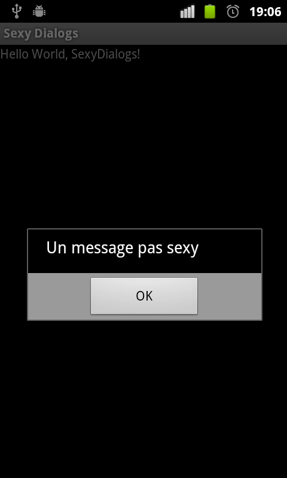
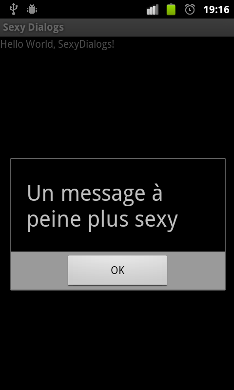
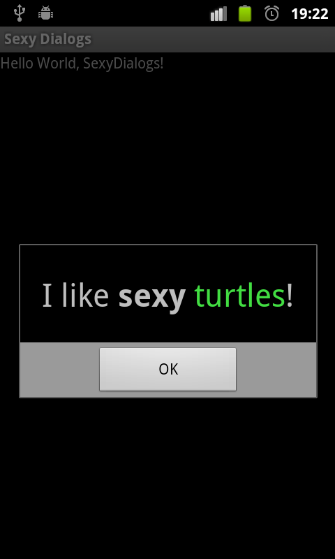

## Introduction


On reproche souvent aux **applications Android** d'être... **moches**. Et ce serait la faute du framework Android, qui fournirait des composants qui n'ont pas la _Apple sexy touch_. Peut-être est-ce le cas, mais faudrait voir à ne pas être trop **paresseux**.


Prenons le cas des **boîtes de dialogue**. A priori, il n'y a rien de plus **ennuyeux**, et rien ne ressemble plus à une boîte de dialogue... qu'une autre boîte de dialogue. Sauf si vous décidez de changer leur style graphique, ce qui risque d'une part de perdre vos utilisateurs, et d'autre part de vous demander du boulot.


Je vous propose d'aborder quelques techniques simples pour donner **un peu de vie** à vos **boîtes de dialogues**, sans trop vous fatiguer.


## Dialogue fadasse


Voici un exemple classique de boîte de dialogue :


```java
new AlertDialog.Builder(this)
		.setMessage("Un message pas sexy")
		.setPositiveButton(android.R.string.ok, new DialogInterface.OnClickListener() {
			public void onClick(DialogInterface dialog, int which) {
				// Do something
			}
		})
		.show();
```

_Je préfère créer et gérer manuellement mes boîtes de dialogue plutôt qu'utiliser `showDialog()` et `onCreateDialog()`, que je n'ai jamais réussi à utiliser correctement dès que les cas d'utilisation se corsent._





## Une vue custom


Je vous propose de personnaliser le message affiché par notre boîte de dialogue. Plutôt que `setMessage()`, il suffit d'appeller `setView()`, qui prend en paramètre n'importe quel type de `View`.


Par exemple une `TextView`, définie ici dans un `layout` :

```xml
<?xml version="1.0" encoding="utf-8"?>
<TextView
    xmlns:android="http://schemas.android.com/apk/res/android"
    android:layout_width="fill_parent" 
    android:layout_height="wrap_content" 
    android:textSize="30sp"
    android:padding="20dp"
    />
```

_Petit rappel, vos layouts xml n'ont **aucune raison** de commencer systématiquement par un `LinearLayout` ou un `RelativeLayout`._


Ensuite, il suffit de gonfler (_inflate_ ;)) ce `layout`, et de le définir comme vue de la boîte de dialogue :

```java
TextView messageView = (TextView) View.inflate(this, R.layout.dialog, null);
messageView.setText("Un message à peine plus sexy");

new AlertDialog.Builder(this) //
		.setView(messageView) //
		.setPositiveButton(android.R.string.ok, new DialogInterface.OnClickListener() {
			@Override
			public void onClick(DialogInterface dialog, int which) {
				// Do something
			}
		}) //
		.show();
```

_Notez l'utilisation de `View.inflate()`, plutôt que `LayoutInflater.from(context).inflate()`, ou encore **pire**, `((LayoutInflater)context.getSystemService(Context.LAYOUT_INFLATER_SERVICE)).inflate()`_


Et voilà le travail :




## Un peu de style


Dans un [précédent article](/2011/10/01/un-peu-de-style-dans-la-textview/), nous avons découvert `Html.fromHtml()` qui se marie très bien avec une `TextView`. Mettons-le à profit :


```java
TextView messageView = (TextView) View.inflate(this, R.layout.dialog, null);
CharSequence message = Html.fromHtml("I like <b>sexy</b> <font color=\"#42dd42\">turtles</font>!");
messageView.setText(message);
```





Évidemment, c'est mieux avec l'i18n, ajoutons donc une entrée à **strings.xml** :


```xml
<?xml version="1.0" encoding="utf-8"?>
<resources>
    <!-- ... -->
    <string name="dialog_message"><![CDATA[I like <b>sexy</b> <font color="#42dd42">turtles</font>!"]]></string>
</resources>
```


Et notre code devient :


```java
CharSequence message = Html.fromHtml(getString(R.string.dialog_message));
```


## Et avec une photo sexy ?


Saviez-vous que `Html.fromHtml()` supporte la balise `img`, et permet de charger des images locales, grâce à un [ImageGetter](http://developer.android.com/reference/android/text/Html.ImageGetter.html) ? 


Ajoutons une image à notre message :


```xml
<?xml version="1.0" encoding="utf-8"?>
<resources>
    <!-- ... -->
    <string name="dialog_message"><![CDATA[I like  <b>sexy</b> <font color=\"#42dd42\">turtles</font>!"]]></string>
</resources>
```


Ainsi que la **ressource** correspondante :


Il n'y a plus qu'à créer un `ImageGetter` qui sait charger un `Drawable` à partir de son **nom** de ressource :


```java
ImageGetter imageGetter = new ImageGetter() {
	@Override
	public Drawable getDrawable(String source) {
		String name = source.replace("/", "");
		Resources resources = getResources();
		int drawableId = resources.getIdentifier(name, "drawable", getPackageName());
		if (drawableId != 0) {
			Drawable drawable = resources.getDrawable(drawableId);
			drawable.setBounds(0, 0, drawable.getIntrinsicWidth(), drawable.getIntrinsicHeight());
			return drawable;
		} else {
			return null;
		}
	}
};

CharSequence message = Html.fromHtml(getString(R.string.dialog_message), imageGetter, null);
```


Et le tour est joué :


[](http://commons.wikimedia.org/wiki/File:Trachemys_scripta_elegans.JPG)

_turtle's head by Betta.1_


## Conclusion

Ces quelques lignes de code permettent de **rapidement** mettre en avant les **informations importantes** au sein d'une **boîte de dialogue**, sans pour autant **déstabiliser** l'utilisateur.


Bien entendu, **l'abus** de boîte de dialogues est **dangereux** pour la santé mentale des utilisateurs, à afficher avec **modération** !

## Comments
