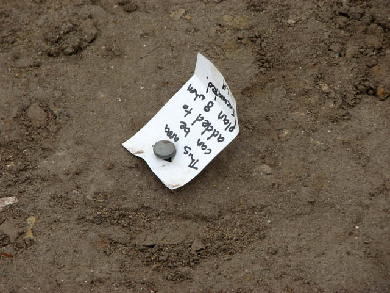
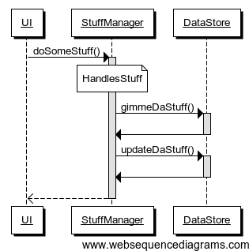
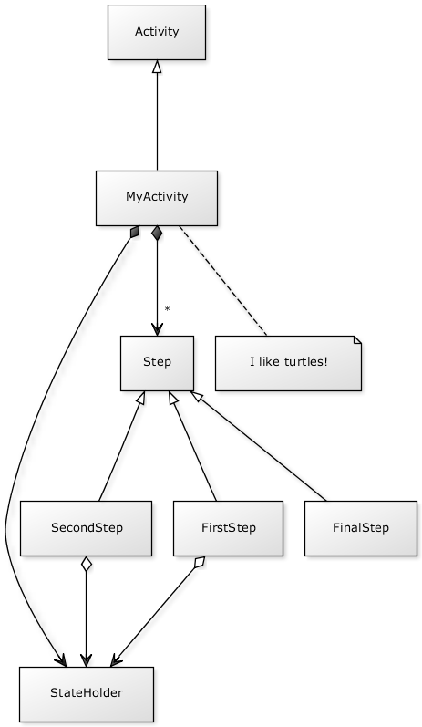

## Introduction


Il est généralement admis qu'utiliser un système de **gestion de version** (**décentralisé** de préférence) pour le **code** d'un projet est une **bonne chose**.


Mais qu'en est-il des documents de **spécifications** fonctionnelles et techniques ? Loin de l'approche monolithique du cycle en V, les adeptes des **méthodes agiles** ont à coeur de **faire évoluer** ces documents très fréquemment. D'aucuns pourraient penser que les posts-it de Scrum remplacent avantageusement tout document de spécification...


[](https://secure.wikimedia.org/wikipedia/commons/wiki/File:Archaeological_post-it_label_-_geograph.org.uk_-_1303183.jpg)

_Archaeological post-it label by Evelyn Simak_


## Versionner les spécifications


N'oubliez pas, _être agile_ ne constitue pas une excuse pour ne pas écrire de documentation. Pareil pour le [design émergeant](http://en.wikipedia.org/wiki/Emergent_Design). Bien au contraire, il est d'autant plus important de consigner et conserver le savoir fonctionnel et technique.


[](https://secure.wikimedia.org/wikipedia/commons/wiki/File:SteacieLibrary.jpg)

_Steacie Science and Engineering Library at York University, by Raysonho@Open Grid Scheduler_


Vous qui posez un tag sur votre code dans votre système de gestion de version (VCS) lors d'une nouvelle release, êtes-vous capables de retrouver **plus tard** les spécifications fonctionnelles et techniques correspondant à cette release ?


Un moyen simple pour y parvenir est d'héberger ces documents dans le **même VCS que le code**. Ainsi, tout tag/branche contiendra automatiquement la bonne version des spécifications.


## Diff de specs ?


Allons plus loin : un VCS n'a pas pour seul but de conserver l'**historique d'un projet** ; il permet aussi d'appréhender les **changements** réalisés, grâce aux outils de **diff**. C'est évidemment essentiel pour assembler le travail parallèle des différents développeurs, pour comprendre l'origine d'un bug, pour toute revue de code, etc.


Le problème des outils de diff est qu'ils fonctionnent très bien pour tout ce qui est **textuel**, et beaucoup moins bien lorsqu'ils ont affaire à des fichiers **binaires**. Malheureusement, les **documents de spécifications** sont bien souvent des fichiers **Word** ou **LibreOffice**, qui entrent dans cette catégorie.


Il existe pourtant un format textuel tout à fait adapté: [Markdown](http://fr.wikipedia.org/wiki/Markdown). La syntaxe de ce langage est réellement accessible, même pour les membres non techniques de votre équipe :


```text
# Titre du document
## Mon sous titre

Un paragraphe contenant un [lien absolu](http://www.google.com), un
[lien relatif](../autrePage), et une .

* une liste à puces
* avec une sous liste
  * contenant un élément *en italique*
  * et un élément **en gras**
```


De plus, les documents Markdown peuvent aisément être visualisés en HTML ou PDF, si vous ne disposez pas d'un [éditeur dédié](http://mouapp.com/). Il existe même [des scripts](http://freewisdom.org/projects/python-markdown/odt2txt) pour convertir de l'ODT en Markdown.


[Bref](http://www.canalplus.fr/c-divertissement/pid3848-c-bref.html?tab=1), vous n'avez aucune excuse valable ;-).


## Retour d'expérience


Chez [Siine](http://www.siine.com), nous hébergeons nos projets sur [GitHub](http://github.com), et chaque **User Story** fait l'objet d'une [branche dédiée](http://blog.piwai.info/2011/10/09/roooh-jai-encore-oublie-ma-branche-git/).


Les **spécifications** fonctionnelles et techniques relatives à une User Story sont écrites en **Markdown**, sur la **branche dédiée** à cette User Story. 


Lorsque la **User Story** est prête à être intégrée sur la branche de développement, le développeur crée une [pull request](http://help.github.com/send-pull-requests/). Il suffit alors d'ouvrir l'onglet **Diff** de la pull request pour tout de suite identifier les **changements** fonctionnels et techniques introduits par cette User Story.


## Diagrammes


Tous les **fichiers binaires** ne peuvent pas forcément être remplacés par des fichiers **textuels** ; c'est le cas des **diagrammes techniques**.


A moins que... en êtes-vous si sûr ?


[websequencediagrams.com](http://websequencediagrams.com) et [yuml.me](http://yuml.me) vous proposent d'exprimer le contenu de vos diagrammes sous forme de texte, et se chargent de générer l'image correspondante.


### websequencediagrams


**websequencediagrams** permet de générer des diagrammes de séquence, et offre même le luxe de choisir le style utilisé.


```text
UI->StuffManager: doSomeStuff()
note over StuffManager: HandlesStuff
activate StuffManager
StuffManager->DataStore:gimmeDaStuff()
activate DataStore
DataStore->StuffManager:
deactivate DataStore
StuffManager->DataStore:updateDaStuff()
activate DataStore
DataStore->StuffManager:
deactivate DataStore
StuffManager-->UI:
deactivate StuffManager
```


[](http://www.websequencediagrams.com/?lz=VUktPlN0dWZmTWFuYWdlcjogZG9Tb21lAA8FKCkKbm90ZSBvdmVyIAAYDkhhbmRsZXMANgUKYWN0aXZhdGUAFw0KAEsMLT5EYXRhU3RvcmU6Z2ltbWVEYQBaCAA0CQAZCQoAIwkAgQ0PCmRlABsTAFAYdXBkYXQAEFktPlVJAIEEDQCCOgw&s=qsd)


### yUML


**yUML** permet de générer des diagrammes UML de [classe](http://yuml.me/diagram/class/draw), d'[activité](http://yuml.me/diagram/activity/draw), et de [cas d'utilisation](http://yuml.me/diagram/usecase/draw).


```text
[Activity]^[MyActivity]
[MyActivity]-[note: I like turtles!]
[Step]^[FirstStep]
[Step]^[SecondStep]
[Step]^[FinalStep]
[MyActivity]++->[StateHolder]
[MyActivity]++-*>[Step]
[FirstStep]+->[StateHolder]
[SecondStep]+->[StateHolder]
```


[](http://yuml.me/diagram/class/[Activity]^[MyActivity], [MyActivity]-[note: I like turtles!], [Step]^[FirstStep], [Step]^[SecondStep], [Step]^[FinalStep], [MyActivity]++->[StateHolder], [MyActivity]++-*>[Step], [FirstStep]+->[StateHolder], [SecondStep]+->[StateHolder].)


Connaissez-vous d'autres outils bien pratiques de ce type ?

## Comments

## [Maxime Sinclair](http://eclectic.eklablog.com/)

Tout à fait en ligne avec ton article. Ce qu’il faut versionner, c’est le produit logiciel. Et le logiciel ce n’est pas juste du code, c’est aussi l’ensemble de la documentation associée (spécification, cahier de tests, manuel utilisateur,…).

Pour la documentation, il faut savoir que Word propose un mode différentiel où il affiche les différences sous la forme de marques de révision. Je me souviens que ceci marchait très bien avec TortoiseSVN.
En ce qui concerne les diagrammes, il y a [PlantUML](http://plantuml.sourceforge.net) qui supporte tous les diagrammes UML mais aussi les diagrammes [Ditaa](http://ditaa.sourceforge.net), qui est aussi disponible en mode cloud et, ce qui ne gâte rien, qui est open source.
Allez, un petit [sudoku](http://www.plantuml.com/plantuml/img/AovDoSyk1G00) pour conclure.

## [Piwaï](/contact.html)
Merci Maxime pour le complément d’info, je ne connaissais pas ces deux derniers !