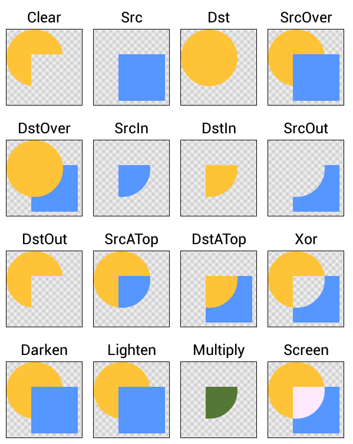
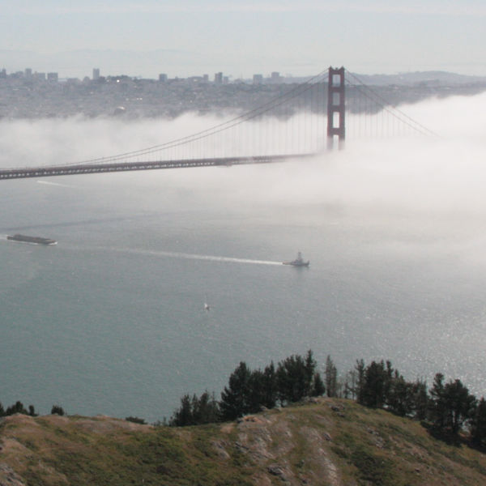
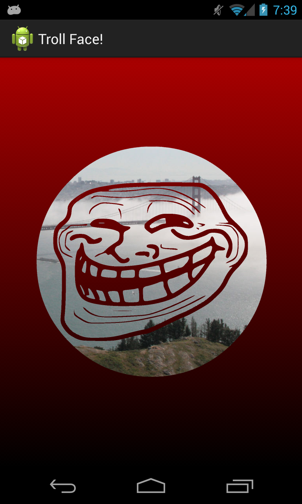

|:material-calendar-edit:|April 23, 2013|

A few months ago, Square published a great article on [Transparency with JPEGs](http://corner.squareup.com/2013/01/transparent-jpegs.html) on Android. It's definitely worth reading! Just don't use the provided code yet :) .

Romain Guy suggested in the comments that you can do this in a much more efficient and simpler way, either by [using a BitmapShader](http://www.curious-creature.org/2012/12/13/android-recipe-2-fun-with-shaders/) or by playing with Porter-Duff blending modes.

Using a bitmap shader is great for dynamic masks. To apply a static mask to a bitmap loaded from a JPEG, Porter-Duff is the way to go, as we will see in this article.

## Principle

We just need to load the bitmap, and then draw the mask on top of it with the right [Porter-Duff](http://en.wikipedia.org/wiki/Alpha_compositing#Description) mode.

Here is what the [Android documentation](http://developer.android.com/reference/android/graphics/PorterDuff.Mode.html) has to say about the different modes:

* ADD 	Saturate(S + D)  
* CLEAR 	[0, 0]  
* DARKEN 	[Sa + Da - Sa*Da, Sc*(1 - Da) + Dc*(1 - Sa) + min(Sc, Dc)]  
* DST 	[Da, Dc]  
* DST_ATOP 	[Sa, Sa * Dc + Sc * (1 - Da)]  
* DST_IN 	[Sa * Da, Sa * Dc]  
* DST_OUT 	[Da * (1 - Sa), Dc * (1 - Sa)]  
* DST_OVER 	[Sa + (1 - Sa)*Da, Rc = Dc + (1 - Da)*Sc]  
* LIGHTEN 	[Sa + Da - Sa*Da, Sc*(1 - Da) + Dc*(1 - Sa) + max(Sc, Dc)]  
* MULTIPLY 	[Sa * Da, Sc * Dc]  
* OVERLAY 	 
* SCREEN 	[Sa + Da - Sa * Da, Sc + Dc - Sc * Dc]  
* SRC 	[Sa, Sc]  
* SRC_ATOP 	[Da, Sc * Da + (1 - Sa) * Dc]  
* SRC_IN 	[Sa * Da, Sc * Da]  
* SRC_OUT 	[Sa * (1 - Da), Sc * (1 - Da)]  
* SRC_OVER 	[Sa + (1 - Sa)*Da, Rc = Sc + (1 - Sa)*Dc]  
* XOR 	[Sa + Da - 2 * Sa * Da, Sc * (1 - Da) + (1 - Sa) * Dc]

Crystal clear! Hopefully the [Xfermodes example](http://gitorious.org/freebroid/development/blobs/62e92d7a2a3fd2798901ec2e7c452ff0e4067163/samples/ApiDemos/src/com/example/android/apis/graphics/Xfermodes.java) in the API Demos demonstrates what the different modes do:



The **yellow** circle is the **destination** bitmap and the **blue** rectangle is the **source** bitmap. The destination is drawn normally, then the source is drawn on top of that using the given Porter-Duff mode.

To apply the **alpha mask**, we will therefore use `DST_IN`.

## Applying the mask

Let's say we have a nice JPEG:



And a PNG that we want to use as a mask:


First, we load the bitmap:
```java
BitmapFactory.Options options = new BitmapFactory.Options();
if (Build.VERSION.SDK_INT >= Build.VERSION_CODES.HONEYCOMB) {
  // Starting with Honeycomb, we can load the bitmap as mutable.
  options.inMutable = true;
}
// We could also use ARGB_4444, but not RGB_565 (we need an alpha layer).
options.inPreferredConfig = Bitmap.Config.ARGB_8888;
Resources res = getResources();
Bitmap source = BitmapFactory.decodeResource(res, R.drawable.golden_gate, options);
Bitmap bitmap;
if (source.isMutable()) {
  bitmap = source;
} else {
  bitmap = source.copy(Bitmap.Config.ARGB_8888, true);
  source.recycle();
}
// The bitmap is opaque, we need to enable alpha compositing.
bitmap.setHasAlpha(true);
```

Next we draw the mask on the bitmap with a canvas, using the `DST_IN` Porter-Duff mode:
```java
Canvas canvas = new Canvas(bitmap);
Bitmap mask = BitmapFactory.decodeResource(res, R.drawable.troll_face);
Paint paint = new Paint();
paint.setXfermode(new PorterDuffXfermode(PorterDuff.Mode.DST_IN));
canvas.drawBitmap(mask, 0, 0, paint);
// We do not need the mask bitmap anymore.
mask.recycle();
```

Finally we just use the bitmap:
```java
ImageView trollFace = (ImageView) findViewById(R.id.troll_face);
trollFace.setImageBitmap(bitmap);
```

## Result

There you go, Troll Face Golden Gate!


Here is a helper method to do this all at once:
```java
public static Bitmap getMaskedBitmap(Resources res, int sourceResId, int maskResId) {
  BitmapFactory.Options options = new BitmapFactory.Options();
  if (Build.VERSION.SDK_INT >= Build.VERSION_CODES.HONEYCOMB) {
    options.inMutable = true;
  }
  options.inPreferredConfig = Bitmap.Config.ARGB_8888;
  Bitmap source = BitmapFactory.decodeResource(res, sourceResId, options);
  Bitmap bitmap;
  if (source.isMutable()) {
    bitmap = source;
  } else {
    bitmap = source.copy(Bitmap.Config.ARGB_8888, true);
    source.recycle();
  }
  bitmap.setHasAlpha(true);
  Canvas canvas = new Canvas(bitmap);
  Bitmap mask = BitmapFactory.decodeResource(res, maskResId);
  Paint paint = new Paint();
  paint.setXfermode(new PorterDuffXfermode(PorterDuff.Mode.DST_IN));
  canvas.drawBitmap(mask, 0, 0, paint);
  mask.recycle();
  return bitmap;
}
```

## Update

If you want to understand Porter-Duff blending modes in details, you should read this great article: [Porter/Duff Compositing and Blend Modes](http://ssp.impulsetrain.com/2013/03/17/porterduff-compositing-and-blend-modes/) (special thanks to [Cyril Mottier](http://cyrilmottier.com/) for the link).

## Comments

#### [DreamingInDroids](http://www.google.com)
Brilliant! Thanks for the pictures demonstrating the different Porter-Duff modes! I had been wondering about them for a long time!

#### [Casey](http://www.google.com)
Very useful! I'm writing a children's puzzle app and this is a quick and easy way to create a base (ie. a square with the puzzle shape cut out of it) for the puzzle with an interesting texture. Thanks =)
